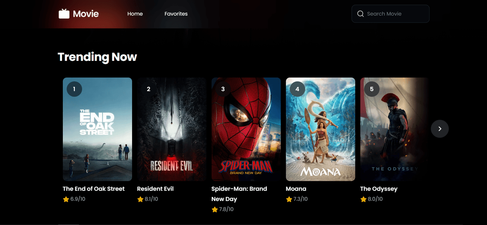
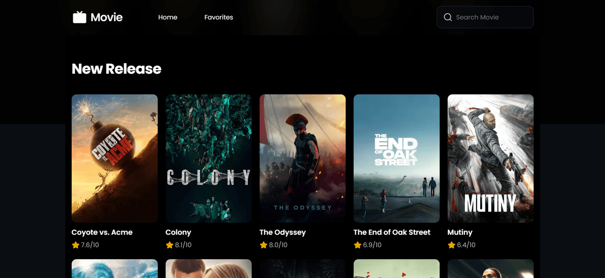
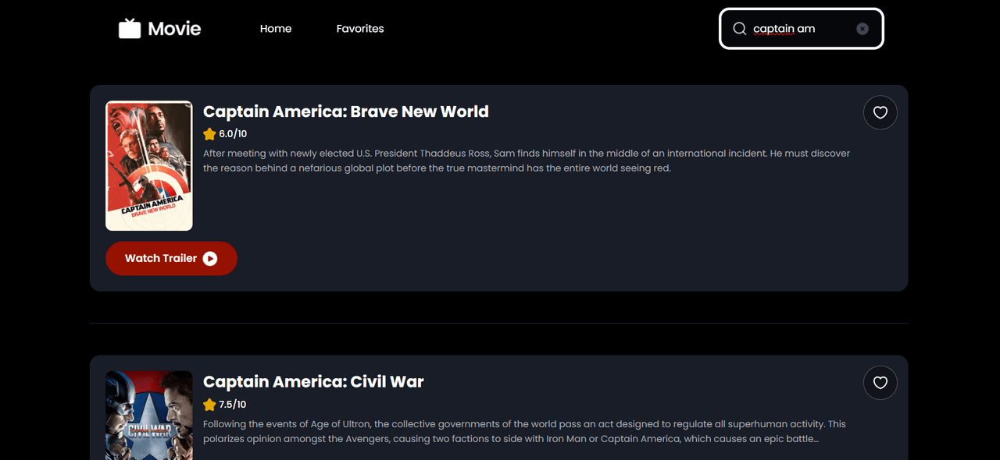
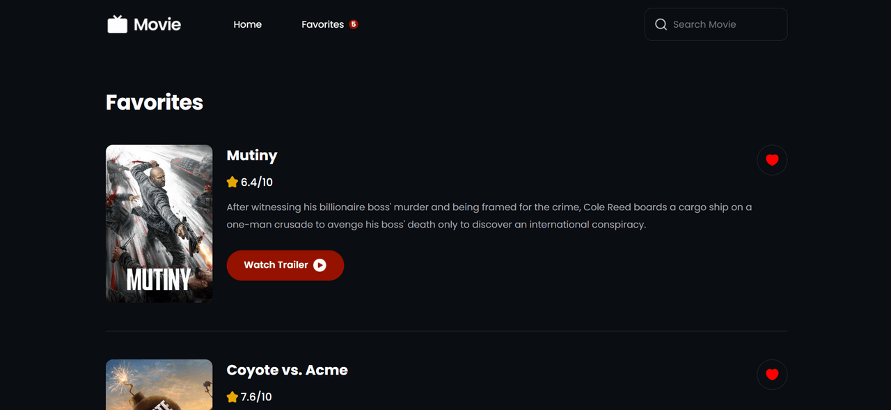
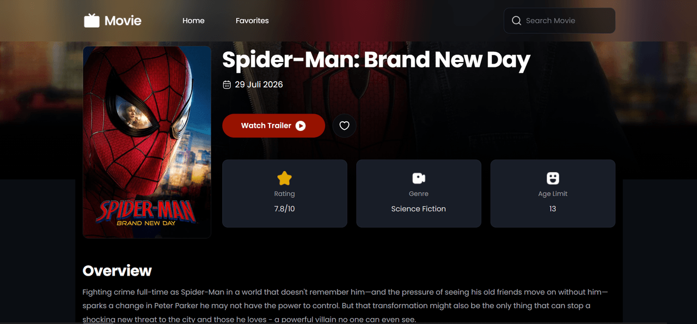
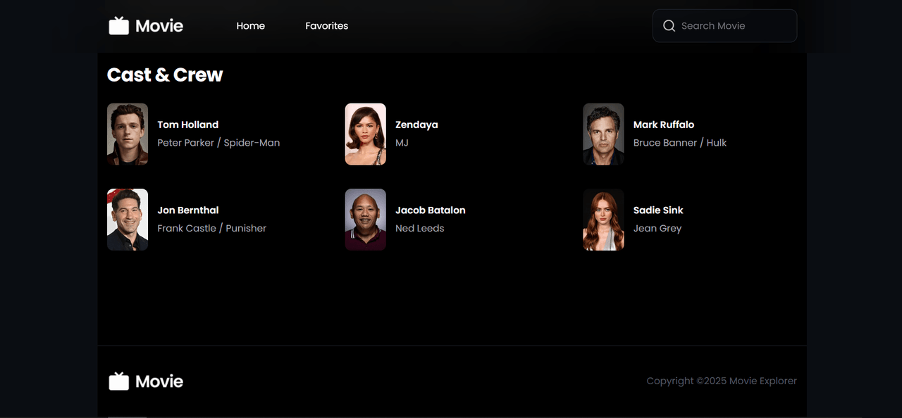
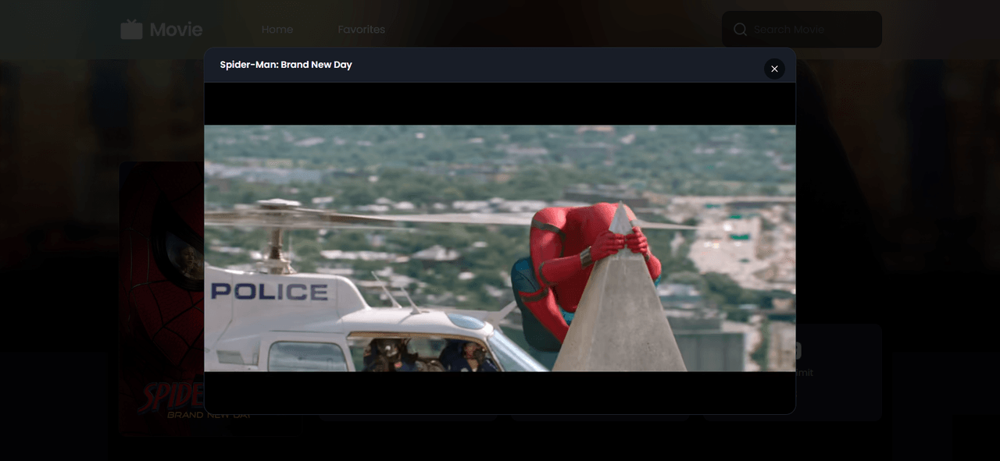

# Movie Explorer

A movie discovery app built with React and the TMDB API — browse popular and trending titles, search, view details (cast, trailers, similar movies), and keep a favorites list that persists across sessions.

## Tech Stack

- **React 19** + **TypeScript** + **Vite**
- **TanStack React Query** — data fetching & caching
- **Zustand** — favorites state, persisted to localStorage
- **React Router** — routing
- **Radix UI & shadcn/ui** — accessible UI primitives
- **Zod & React Hook Form** — search validation
- **Framer Motion** — animations & transitions
- **Tailwind CSS** — styling

## Screenshots

| Home | Trending Now | New Release |
| --- | --- | --- |
|  |  |  |

| Search | Favorites |
| --- | --- |
|  |  |

| Movie Detail | Cast & Crew | Trailer |
| --- | --- | --- |
|  |  |  |

## Getting Started

### 1. Install dependencies

```bash
npm install
```

### 2. Configure environment variables

Copy `.env.example` to `.env` and add your [TMDB API key](https://www.themoviedb.org/settings/api):

```bash
cp .env.example .env
```

```env
VITE_TMDB_API_KEY=your_api_key_here
```

### 3. Run the dev server

```bash
npm run dev
```

## Features

- **Home** — popular, now playing, and trending movies
- **Search** — debounced search with validation
- **Movie Detail** — overview, rating, genres, cast & crew, similar movies, trailer playback
- **Favorites** — add/remove movies, persisted to localStorage

## Project Structure

```
src/
├── components/       # Reusable components (feature + ui)
├── pages/            # Route-level page components
├── hooks/            # Custom React hooks
├── services/         # TMDB API service functions
├── store/            # Zustand stores
├── types/            # TypeScript types
└── lib/              # Axios instance, utilities, schemas
```

## Scripts

```bash
npm run dev       # start dev server
npm run build     # type-check + production build
npm run lint      # lint
npm run preview   # preview production build
```
